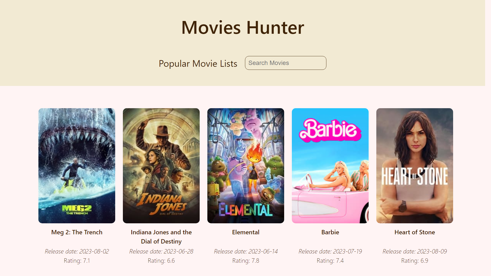

# Movies Hunter

Movies Hunter is a web application that allows you to search for movies and access detailed information about them. It's built using the React library and Vite framework, and it uses the TMDB (The Movie Database) API to fetch movie data.

## Features

- Search for movies by title, keywords, or genres.
- View detailed information about a movie, including its cast, release date, rating, and more.
- Discover popular and trending movies.
- Save your favorite movies to a watchlist.
- Responsive design for a seamless experience on desktop and mobile devices.

## Demo

You can try out Movies Hunter by visiting [Demo Link](https://example.com/movies-hunter-demo).