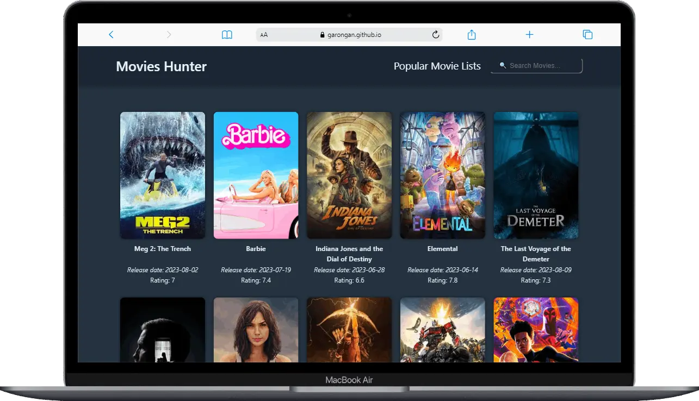
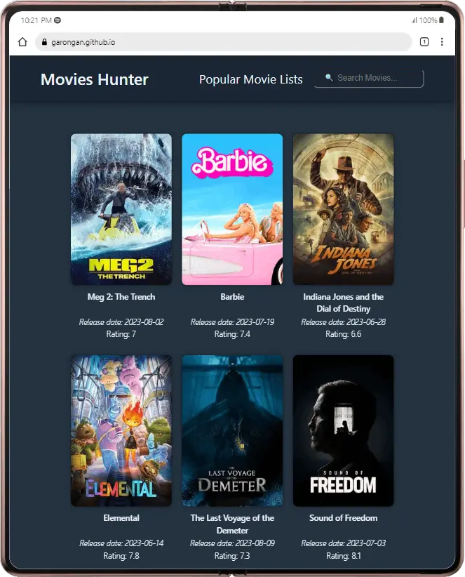

# Movies Hunter

Movies Hunter is a web application that allows you to search for movies and access detailed information about them. It's built using the React library and Vite framework, and it uses the TMDB (The Movie Database) API to fetch movie data.

## Features

- Search for movies by title.
- View detailed information about a movie, including release date and rating
- Discover popular movies.
- Responsive design for a seamless experience on desktop and mobile devices.

## Demo

You can try out Movies Hunter by visiting [Demo Link](https://garongan.github.io/movies-hunter).
